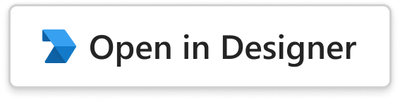

# Project Dashboard

## Summary

The **Project Dashboard Card** provides a comprehensive at-a-glance view of a project's health. It features **KPI tiles** that rearrange responsively from a 4-column row on wide screens to a 2x2 grid on narrow screens to a single-column stack on very narrow screens. The milestones timeline and team roster sit side-by-side on desktop but stack vertically on mobile, ensuring readability across all device widths.

_bot-sent_ card example:


## Compatibility


## Solution

Solution|Author(s)
--------|---------
Project Dashboard | <a href="https://github.com/VikrantSingh01"></a> &nbsp; [Vikrant Singh](https://github.com/VikrantSingh01)

## Version history

Version|Date|Comments
-------|----|--------
1.0| February 14, 2026 | Initial release

### Disclaimer

_**THIS CODE IS PROVIDED _AS IS_ WITHOUT WARRANTY OF ANY KIND, EITHER EXPRESS OR IMPLIED, INCLUDING ANY IMPLIED WARRANTIES OF FITNESS FOR A PARTICULAR PURPOSE, MERCHANTABILITY, OR NON-INFRINGEMENT.**_

## Responsive Layouts

This card utilizes the responsive framework, allowing for multiple layouts and content modifications for specific width ranges. For more details on coding with this framework, see <a href="https://learn.microsoft.com/en-us/microsoftteams/platform/task-modules-and-cards/cards/cards-format?tabs=adaptive-md%2Cdesktop%2Cconnector-html#adaptive-card-responsive-layout">Design responsive Adaptive Cards</a>.

### Layout Breakpoints

| Width | KPI Tiles | Milestones + Team | Activity Timestamps |
|---|---|---|---|
| **VeryNarrow** | Single column stack | Single column stack | Hidden |
| **Narrow** | 2x2 grid | Single column stack | Visible |
| **Standard+** | 4 columns in a row | Side-by-side (60/40 split) | Visible |

### Responsive Features Used

- **Two `Layout.AreaGrid` layouts on KPI container** — 4-column grid at Standard+, 2x2 grid at Narrow, default stack at VeryNarrow
- **`Layout.AreaGrid` on milestones/team section** — side-by-side at Standard+, stacked on mobile
- **`targetWidth: "AtLeast:Narrow"`** — shows milestone dates and activity timestamps only when there's room
- **`targetWidth: "VeryNarrow"`** — condensed due date display for very narrow screens
- **`Badge`** component — project status indicator
- **`Icon`** elements — milestone status indicators (completed, in-progress, pending)
- **`RichTextBlock`** — mixed-weight activity feed entries

<br/><br/>

## 1) Personalize This Card

### Step-by-step instructions and tips

#### 1) Copy the card JSON into the Designer Tool

Copy the [card](card.json) payload and click on the **'Open in Designer'** button to start working in the Designer platform.

_To create a "full width" card, add the following code to the JSON._

```json
"msTeams": {
  "width": "full"
}
```

<a href="https://dev.teams.microsoft.com/cards/new" target="_blank">
  
</a>

#### 2) Update KPI Tiles

Replace the completion percentage, task counts, bug count, and days remaining with your actual project metrics.

#### 3) Update Milestones

Customize the milestone names, dates, and status icons to match your project plan.

#### 4) Update Team Members

Replace avatars, names, and roles with your project team.

#### 5) Connect to Your Data Source

Integrate with Azure DevOps, Jira, GitHub Projects, or your preferred project management tool to auto-populate metrics.

#### 6) Update Button Actions

Point the "Open project" and "View all tasks" buttons to your project's actual URLs.

## 2) Test Your Card

Road test your cards considering the following:

* **Themes:** Light Mode, Dark Mode, High Contrast
* **Common widths:** Chat, Channel, Meeting Chat, Phone (iOS - Portrait/landscape, Android - Portrait/landscape), Tablet (iOS - Portrait/landscape, Android - Portrait/landscape)
* **Accessibility:** Color contrast, keyboard tabbing, voice assistance

## Implementation Details

* The **KPI tiles section** uses two `Layout.AreaGrid` definitions on a single container — one targeting `atLeast:Standard` (4-column row) and another targeting `Narrow` (2x2 grid). At VeryNarrow, it falls back to the default `Layout.Stack`.

* The **milestones + team section** uses `Layout.AreaGrid` with `targetWidth: "atLeast:Standard"` for a 60/40 split. On narrower widths, milestones and team stack vertically.

* **Milestone dates** and **activity timestamps** use `targetWidth: "AtLeast:Narrow"` so they're hidden on VeryNarrow to save horizontal space.

* The **due date** in the header uses dual rendering: inline with the badge on Narrow+ and a separate line on VeryNarrow.

## Resources & Tools

* **Learn**: [Design Adaptive Cards for Your Teams App](https://learn.microsoft.com/en-us/microsoftteams/platform/task-modules-and-cards/cards/design-effective-cards?tabs=design) and [Build Cards](https://learn.microsoft.com/en-us/microsoftteams/platform/task-modules-and-cards/what-are-cards)
* **Design**: [The Microsoft Teams UI Kit](https://www.figma.com/community/file/916836509871353159)
* **Build**: [Adaptive Card Designer](https://dev.teams.microsoft.com/cards)

## Contribute

Refer to the [contribution docs](/CONTRIBUTE.md) for more information.
