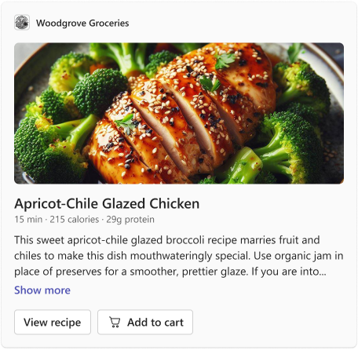
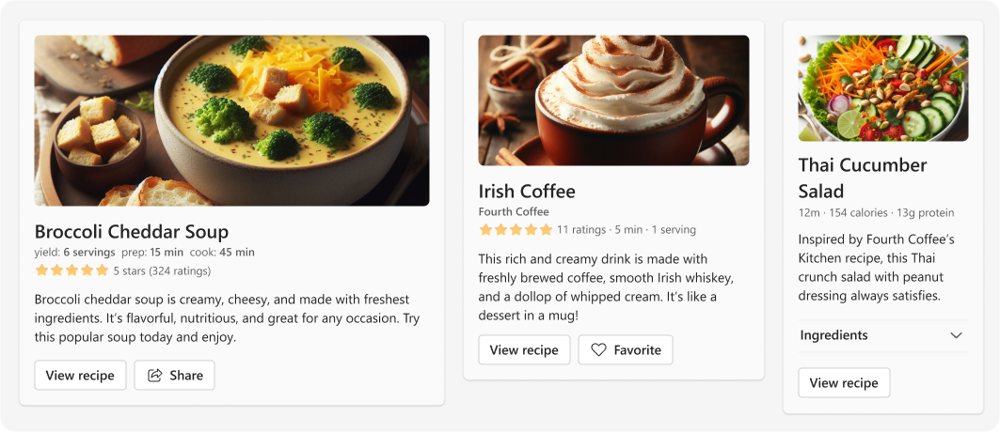

# Recipe


## Summary

Draw in your audience with the <b>Recipe Card</b> (AKA _Hero Showcase Card_), where a <b>captivating image</b> sets the stage for your featured content. Whether it’s a <b>recipe</b> or a <b>special feature</b>, users can expand the card to uncover the full story at their leisure.

_user-sent_ card example:



## Compatibility


## Solution

Solution|Author(s)
--------|---------
recipe | <a href="https://github.com/SuzanneTocco"></a> &nbsp; [Suz Tocco](https://github.com/SuzanneTocco) \| Microsoft  

## Version history

Version|Date|Comments
-------|----|--------
1.0| October 31, 2023 | Initial release

## Disclaimer

**THIS CODE IS PROVIDED *AS IS* WITHOUT WARRANTY OF ANY KIND, EITHER EXPRESS OR IMPLIED, INCLUDING ANY IMPLIED WARRANTIES OF FITNESS FOR A PARTICULAR PURPOSE, MERCHANTABILITY, OR NON-INFRINGEMENT.**

## Inspiration Gallery

Below you'll find a few alternative expressions of the card.



<br><br>

## 1) 👩‍🎨 Personalize This Card

We designed this card for Teams app partners who need to support your use case. This card type has a unique visual and interaction pattern to ensure a consistent user experience. To make this card suit your needs, simply adjust the text, images, and actions.


### Step by step instructions and tips

#### 1) Open in the Microsoft Teams Designer Editing tool

Teams provides support for this tool, which is ideal for constructing and modifying cards. Copy the [card](card.json) payload and click on the <b>‘Open in Designer’</b> button to start working in the Designer platform.

> [!NOTE]
> Responsive layout is not supported in the Designer.

*To create a "full width" card, add the following code to the JSON.* <br>

```json
"msTeams": {
  "width": "full"
}
```

#### 2) Replace the Hero Image

If you’re creating an image, use a 16:9 aspect ratio. Save the image as a transparent PNG at 2x size to ensure good resolution across endpoints.


#### 4) Update Details/Description and Set Truncation

Set the maximum line truncation as desired. You can choose to keep or remove the “Show more” / “Show less” feature.

#### 5) Update Button Copy and Actions

Customize button text and actions to suit your needs. <br>
For icons, use the color #818181 to ensure readability in light/dark modes. Icons should fit edge-to-edge in a 16x16 square. Save them as transparent PNGs at 2x size for good resolution across endpoints. Access Fluent icon asset links in the [Resources section](#resources--tools) on this page.

<br>
  ***For further design modifications** use the Microsoft Teams UI Kit in Figma to create, visualize, spec <a href="assets/recipeCard_specs.png">(see current card spec)</a> , and verify the layouts before coding.<br />

<a href="https://www.figma.com/community/file/916836509871353159">

</a>

<br>

## 2) 🚗 Test Your Card

This marks the critical point where we ensure that our cards maintain superior quality for every user on every platform. When conducting a road test for your cards, take into account the following considerations:

* <b>Themes:</b> Ensure compatibility with Light Mode, Dark Mode, and High Contrast settings.
* <b>Common widths:</b> Verify the display across various device widths, including Chat, Channel, Meeting Chat, and devices like Phones (iOS in Portrait/Landscape, Android in Portrait/Landscape) and Tablets (iOS in Portrait/Landscape, Android in Portrait/Landscape).
* <b>Accessibility:</b> When designing new visuals, check for color contrast compliance, ensure smooth navigation using keyboard or mobile equivalents, and confirm that voice assistants can accurately read the card content.

## Resources & Tools ##

* **Learn**: For complete details on how to design and build adaptive cards for your Teams app, visit the Microsoft Teams Learn website pages on  [Design Adaptive Cards for Your Teams App](https://learn.microsoft.com/en-us/microsoftteams/platform/task-modules-and-cards/cards/design-effective-cards?tabs=design) and [Build Cards](https://learn.microsoft.com/en-us/microsoftteams/platform/task-modules-and-cards/what-are-cards) (You can use the [schema explorer](https://adaptivecards.io/explorer/) to learn about the structure and options of each element.

* **Design**: Our tools can help you learn Teams patterns and design apps and cards.

  * Design Teams apps and cards with the [The Microsoft Teams UI Kit](https://www.figma.com/community/file/916836509871353159), which has core components, templates, and best practices.
  * Find Microsoft icons from [IconCloud](https://iconcloud.design/browse/Fluent%20System%20Library/Fluent%20Regular) or the [Fluent 2 Iconography site](https://fluent2.microsoft.design/iconography) and modify them to to use in your cards (you'll need to save them out as pngs while we work on building in Fluent icon support).

* **Build**: Edit, build, preview, and test cards with our Teams Development Portal [Adaptive Card Designer](https://dev.teams.microsoft.com/cards).

</p>

## Contribute ##

Refer to the [contribution docs](/CONTRIBUTE.md) for more information.

## Help

We do not support samples, but we this community is always willing to help, and we want to improve these samples. We use GitHub to track issues, which makes it easy for  community members to volunteer their time and help resolve issues.

You can try looking at [issues related to this sample](https://github.com/pnp/AdaptiveCards-Templates/issues) to see if anybody else is having the same issues.


