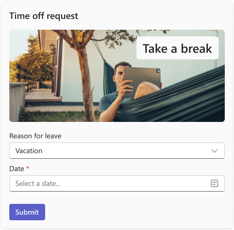
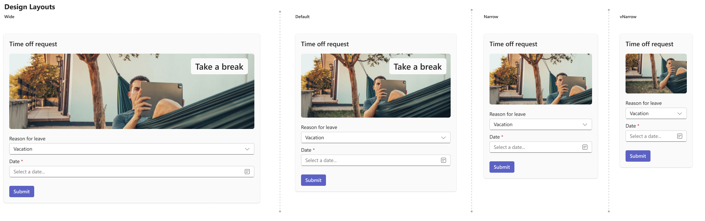

# Simple Time Off Request

## Summary

The <b>Simple Time Off Request Card</b> is designed for <b>ease and efficiency</b>, allowing users to quickly submit their time off requests. Its <b>minimalistic design</b> ensures a clean and user-friendly experience while offering opportunities for visual customization.

Card example:



## Compatibility


## Solution

Solution|Author(s)
--------|---------
Simple Time Off Request | <a href="https://github.com/SuzanneTocco"></a> &nbsp; [Suz Tocco](https://github.com/SuzanneTocco) &nbsp;<a href="https://github.com/pabloas-ms"></a> &nbsp; [Pablo Vicente Astudillo Quintero](https://github.com/pabloas-ms) | Microsoft  

## Version history

Version|Date|Comments
-------|----|--------
1.0| January 30, 2025 | Initial release

### Disclaimer

_**THIS CODE IS PROVIDED _AS IS_ WITHOUT WARRANTY OF ANY KIND, EITHER EXPRESS OR IMPLIED, INCLUDING ANY IMPLIED WARRANTIES OF FITNESS FOR A PARTICULAR PURPOSE, MERCHANTABILITY, OR NON-INFRINGEMENT.**_

## Responsive Layouts

This card utilizes our responsive framework, allowing for multiple layouts or content modifications for specific set width ranges. For more details on coding with this framework, see <a href="https://learn.microsoft.com/en-us/microsoftteams/platform/task-modules-and-cards/cards/cards-format?tabs=adaptive-md%2Cdesktop%2Cconnector-html#adaptive-card-responsive-layout">Design responsive Adaptive Cards</a>.



<br/>

## 1) 👩‍🎨 Personalize This Card

### Step-by-step instructions and tips

#### 1) Copy the card JSON into the Designer Tool

Teams provides support for this tool, which is ideal for constructing and modifying cards. Copy the [card](card.json) payload and click on the <b>‘Open in Designer’</b> button to start working in the Designer platform.


_To create a "full width" card, add the following code to the JSON._ <br>

```json
"msTeams": {
  "width": "full"
}
```

<a href="https://dev.teams.microsoft.com/cards/new" target="_blank">
  
</a>

#### 2) Replace the Hero Image and Text Overlay

Add the image URL and adjust the background image position for different responsive layouts. Update the overlaid text as needed, ensuring the font color remains ```Dark``` for readability in both light and dark themes.

#### 3) Update Input Fields

Modify the input fields and values to capture the required data.

#### 4) Update Button Copy and Actions

Customize button text and add or remove actions to suit your needs. <br>


<br>

***For further design modifications** use the Microsoft Teams UI Kit in Figma to create, visualize, spec, and verify the layouts before coding.<br />

<a href="https://www.figma.com/community/file/916836509871353159">

</a>

<br>

## 2) 🚗 Test Your Card

This is where the rubber meets the road to ensure high quality cards for all users across all endpoints. Road test your cards considering the following:

* <b>Themes:</b> Light Mode, Dark Mode, High Contrast
* <b>Common widths:</b> Chat, Channel, Meeting Chat, Phone (iOS- Portrait/landscape, Android-Portrait/landscape), Tablet (iOS- Portrait/landscape, Android-Portrait/landscape)
* <b>Accessibility:</b> Color contrast if creating new visuals, tabbing with keyboard or mobile equivelents, Voice assistance (readers to read card content)


## Resources & Tools ##

* **Learn**: For complete details on how to design and build adaptive cards for your Teams app, visit the Microsoft Teams Learn website pages on  [Design Adaptive Cards for Your Teams App](https://learn.microsoft.com/en-us/microsoftteams/platform/task-modules-and-cards/cards/design-effective-cards?tabs=design) and [Build Cards](https://learn.microsoft.com/en-us/microsoftteams/platform/task-modules-and-cards/what-are-cards) (You can use the [schema explorer](https://adaptivecards.io/explorer/) to learn about the structure and options of each element.

* **Design**: Our tools can help you learn Teams patterns and design apps and cards.

  * Design Teams apps and cards with the [The Microsoft Teams UI Kit](https://www.figma.com/community/file/916836509871353159), which has core components, templates, and best practices.
 
  * Fluent icons are pre-built into the Designer and support both light and dark modes. You can choose from thousands of ready-to-use icons and select from a set of predefined colors. For more Fluent icon resources, check out [IconCloud](https://iconcloud.design/browse/Fluent%20System%20Library/Fluent%20Regular) or the [Fluent 2 Iconography site](https://fluent2.microsoft.design/iconography). <B>NOTE:</B> If you'd like to create custom icons, they should be saved as .pngs (export at 2x) and colored to ensure they look good in both light and dark modes.

* **Build**: Edit, build, preview, and test cards with our Teams Development Portal [Adaptive Card Designer](https://dev.teams.microsoft.com/cards).

</p>

## Contribute ##

Refer to the [contribution docs](/CONTRIBUTE.md) for more information.
